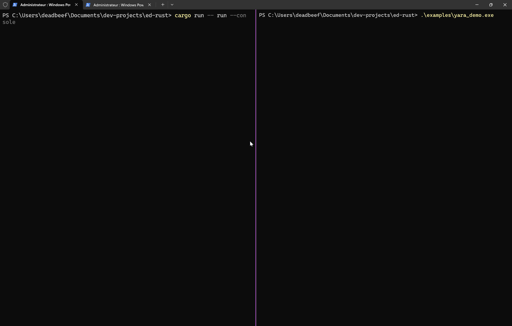

# Rustinel: High-Performance ETW Sentinel

<p align="center">
  
  
  
  
</p>

Rustinel is a Windows-only, user-mode EDR agent built in Rust. It consumes ETW telemetry, normalizes events into a Sysmon-compatible schema, evaluates Sigma and YARA rules in real time, and writes ECS-style NDJSON alerts.

<p align="center">
  
</p>

## Overview
Rustinel focuses on high-volume Windows telemetry without a kernel driver. It uses ETW providers for process, file, registry, network, and operational events, then normalizes and enriches those events for Sigma rules. Detections are emitted as ECS-style NDJSON for easy SIEM ingestion.

## Highlights
- User-mode ETW collection via ferrisetw (no kernel driver).
- Kernel keyword filtering plus router-level network noise filtering.
- Sysmon-style normalization with NT path conversion and PE metadata enrichment.
- Sigma engine with boolean logic, wildcards, regex, and modifier support.
- YARA scanning on process start using a background worker (non-blocking ETW path).
- ECS NDJSON alerts and separate operational logs (tracing).
- Windows Service support (install/start/stop/uninstall).

## Architecture
1. Collector: ferrisetw ETW session with provider keyword filters.
2. Router: provider GUID dispatch; drops noisy network send/recv events.
3. Normalizer: ETW -> Sysmon-style fields, path normalization, enrichment with Process/SID/DNS caches.
4. Detection: Sigma engine and YARA worker.
5. Output: ECS NDJSON alerts + operational logs.

## Requirements
- Windows (ETW + Windows APIs).
- Administrator privileges (ETW access and service management).
- Rust 1.92+ to build from source.

## Quick Start
Use an elevated PowerShell.

```
cargo run
```

Force console output even if logging.console_output is false:

```
cargo run -- run --console
```

## First Demo (Sigma)
This repo ships with a simple demo rule: `rules/sigma/example_whoami.yml`.

1. Start the agent (admin shell):

```
cargo run -- run --console
```

2. In another admin shell, trigger the rule:

```
whoami /all
```

3. Verify an alert was written to `logs/alerts.json.YYYY-MM-DD` and the console shows a Sigma detection.

## First Demo (YARA)
This repo ships with a simple YARA rule: `rules/yara/example_test_string.yar`.

1. Build the demo binary (admin shell):

```
rustc .\examples\yara_demo.rs -o .\examples\yara_demo.exe
```

2. Run it to trigger a YARA scan on process start:

```
.\examples\yara_demo.exe
```

3. Verify an alert was written to `logs/alerts.json.YYYY-MM-DD` with rule name `ExampleMarkerString`.

## Build and Run

Build a release binary:

```
cargo build --release
```

Binary path:

```
target\release\rustinel.exe
```

Run in console mode:

```
.\target\release\rustinel.exe
# or
.\target\release\rustinel.exe run
# force console output
.\target\release\rustinel.exe run --console
```

## Service Mode
The service commands are built into the same binary.

```
.\target\release\rustinel.exe service install
.\target\release\rustinel.exe service start
.\target\release\rustinel.exe service stop
.\target\release\rustinel.exe service uninstall
```

Notes:
- `service install` registers the current executable path. Run it from the final location you want the service to use.
- Config and rule paths are resolved from the current working directory. For services, use absolute paths or environment overrides if needed.

## Configuration
Config is loaded from defaults, `config.toml`, and environment variables prefixed with `EDR__` (double underscore separates levels).

Example `config.toml` (matches defaults):

```toml
[scanner]
sigma_enabled = true
sigma_rules_path = "rules/sigma"
yara_enabled = true
yara_rules_path = "rules/yara"

[logging]
level = "info"              # trace, debug, info, warn, error
directory = "logs"
filename = "rustinel.log"
console_output = true

[alerts]
directory = "logs"
filename = "alerts.json"
```

Environment override examples:

```
EDR__LOGGING__LEVEL=debug
EDR__SCANNER__SIGMA_RULES_PATH=C:\rustinel\rules\sigma
```

## Rules

### Sigma
- Loaded recursively from `rules/sigma` (files: `.yml`, `.yaml`).
- Supports multi-document rules with `action: global`.
- The repo includes example rules prefixed with `example_` and test rules prefixed with `test_`.

### YARA
- Loaded from the top level of `rules/yara` (files: `.yar`, `.yara`).
- YARA is invoked on process start; scans the process image path.
- The repo includes example rules prefixed with `example_` and test rules prefixed with `test_`.

If rule directories are missing, the agent logs a warning and continues.

## Sigma Compatibility

Logsource filtering:
- Only `logsource.category` is used for routing. `product` and `service` are parsed but not enforced.

Categories recognized by the engine:
- `process_creation`
- `network_connection`
- `file_event`
- `registry_event`
- `dns_query`
- `image_load`
- `ps_script`
- `wmi_event`
- `service_creation`
- `task_creation`

Notes:
- The engine has code paths for `file_create`/`file_delete` and `registry_add`/`registry_set`/`registry_delete`, but the current EventID normalization maps file/registry opcodes to Sysmon IDs (11/23, 12/13). As a result, those subcategories are not emitted yet. Use `file_event` and `registry_event` for now.

Condition support:
- `and`, `or`, `not`
- Parentheses
- `1 of them`, `all of them`
- `1 of selection*`, `all of selection*`

Modifier support (non-exhaustive, implemented in code):
- String: `contains`, `startswith`, `endswith`, `all`, `cased`
- Regex: `re` with optional flags `i`, `m`, `s`
- Encoding: `wide`/`utf16`/`utf16le`, `utf16be`, `base64`, `base64offset`
- Other: `windash`, `cidr`, `exists`, `fieldref`, `lt`, `gt`, `le`/`lte`, `ge`/`gte`

## Normalization and Event IDs
Rustinel maps kernel OpCodes to Sysmon-style Event IDs for Sigma compatibility:

- Process Start -> 1 (Sysmon Process Create)
- Process Stop -> 5 (Sysmon Process Terminate)
- Image Load (Kernel-Process OpCode 10) -> 7
- File Create/Overwrite (OpCode 64/65) -> 11
- File Delete (OpCode 70/72) -> 23
- Registry Create/Delete -> 12
- Registry SetValue -> 13
- Network TCP/UDP Connect -> 3
- DNS -> 22
- WMI -> 19
- PowerShell Script Block -> 4104 (Windows Security Event ID)
- Service Install -> 7045 (Windows System Event ID)
- Task Registered -> 106 (TaskScheduler Event ID)

If no mapping exists, the raw ETW Event ID is retained.

## Telemetry Sources
ETW providers enabled by the collector:

- Microsoft-Windows-Kernel-Process (process start/stop, image load)
- Microsoft-Windows-Kernel-Network (connect/accept/disconnect, UDP)
- Microsoft-Windows-Kernel-File (create/delete/rename/setinfo)
- Microsoft-Windows-Kernel-Registry (create/set/delete)
- Microsoft-Windows-DNS-Client
- Microsoft-Windows-PowerShell (script block logging)
- Microsoft-Windows-WMI-Activity
- Microsoft-Windows-Service-Control-Manager (service install)
- Microsoft-Windows-TaskScheduler (task registration)

Noise reduction:
- Kernel keyword masks drop read/write and context-switch noise.
- Router drops network Event IDs 10 and 11 (send/recv).

## Alert Output (ECS NDJSON)

Security alerts are written as one JSON object per line:

- File: `logs/alerts.json.YYYY-MM-DD`
- Format: ECS-style fields at the top level
- Engines: Sigma and YARA both emit here

Example:

```json
{
  "@timestamp": "timestamp_1704067200",
  "event.kind": "alert",
  "event.category": "process",
  "rule.name": "Whoami Execution",
  "rule.severity": "Low",
  "rule.engine": "Sigma",
  "process.executable": "C:\\Windows\\System32\\whoami.exe",
  "process.command_line": "whoami /all",
  "process.parent.executable": "C:\\Windows\\System32\\cmd.exe",
  "user.name": "NT AUTHORITY\\SYSTEM"
}
```

Operational logs are written to `logs/rustinel.log.YYYY-MM-DD`.

## Limitations
- Windows-only; requires Administrator privileges.
- `@timestamp` is emitted in ISO 8601 UTC.
- YARA path conversion is best-effort and assumes common NT path layouts; multi-volume systems may need adjustments.
- `logsource.product` and `logsource.service` are not enforced yet.
- `file_create`/`file_delete` and `registry_add`/`registry_set`/`registry_delete` Sigma subcategories are not emitted yet due to EventID normalization.
- `CommandLine` enrichment is best-effort; very short-lived or protected processes may not expose it in time.

## Roadmap
Short roadmap:
- Active response engine (optional prevention mode, terminate on critical alerts).
- YARA expansion (memory scanning + periodic scans).
- Resource governor (Windows Job Objects CPU limits).
- Self-defense hardening (DACL/ACL restrictions + anti-injection).
- Watchdog sidecar to restart the service if the main process dies.
- ETW integrity checks to detect blinding/tampering.
- Deep inspection via stack tracing for “floating code”.

## License
Apache 2.0. See `LICENSE`.
